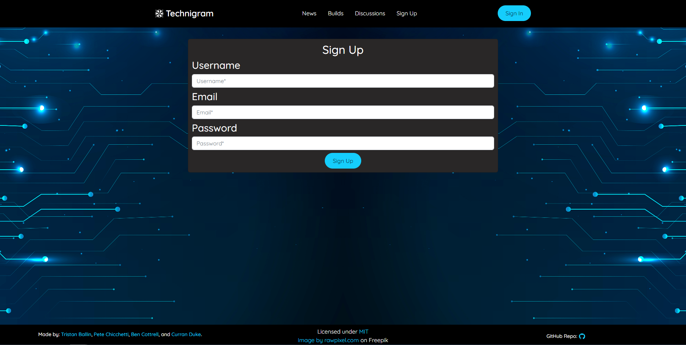
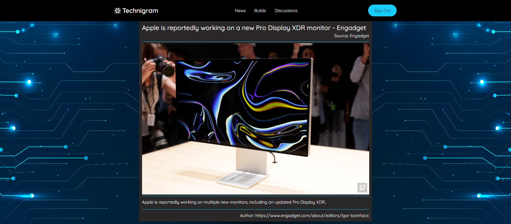
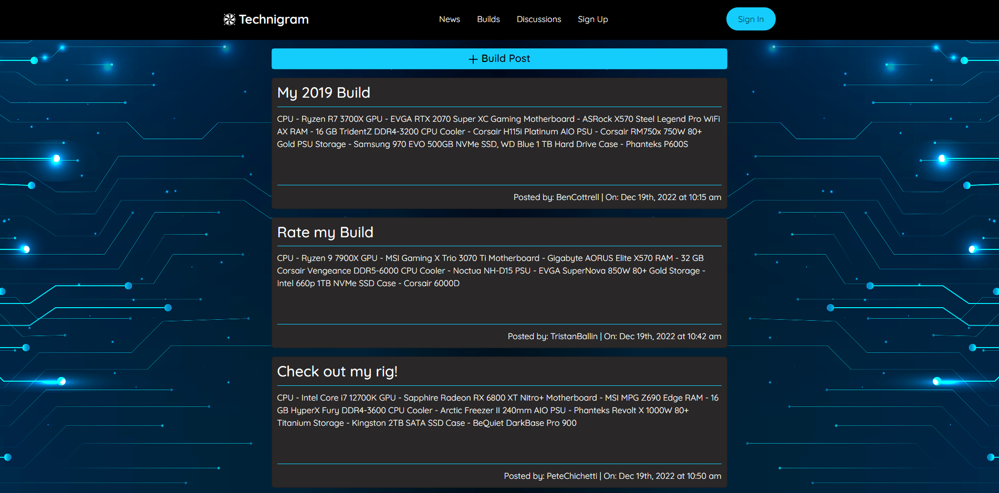
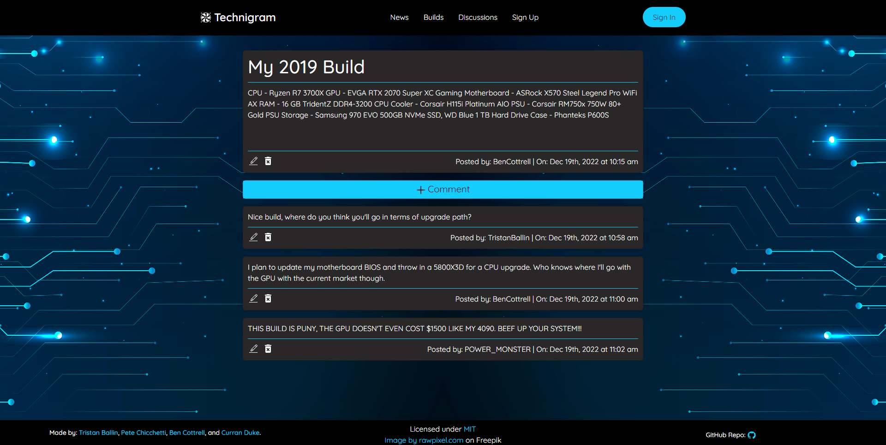

# Technigram

## Description

Technigram's main goal is to create a platform for like minded people to share their computer builds with each other and give feedback, recommendations or just chat about something they are interested in. Custom PC building is a niche enthusiast market, where many builders are very passionate about building PC's for performance, builds on a budget, aesthetics, or any other combination of things. Technigram also includes a convenient tech news page to keep you up to date on the latest in the tech world.

Our motivation for this project came about when all of us were just talking about our computer builds. All of us were excited to see what parts the others were using and how they looked. So we thought, what better way to show them off than to create a website for doing exactly that.

Technigram was built with the MERN stack, utilizing Apollo GraphQL with NodeJS and Express for the server. MongoDB was used to create the database. Technigram was styled using React for structure, React Bootstrap and custom CSS for styling, and drew from the [News API](https://newsapi.org/) to obtain tech news from many different tech publications such as WCCF Tech, Engadget, Eurogamer and Gizmodo. 

(<a href="#readme-top">Back to top</a>)

 ## Table of Contents
  
  1. [Links](#links)
  2. [Screenshots](#screenshots)
  3. [License](#license)

(<a href="#readme-top">Back to top</a>)

## Links

[Application Link](https://murmuring-depths-50021.herokuapp.com)

[Repository](https://github.com/PeteChicchetti/technigram)

(<a href="#readme-top">Back to top</a>)

## Screenshots

(<a href="#readme-top">Back to top</a>)

## License

Licensed under the [MIT license](https://choosealicense.com/licenses/mit/).

Copyright (c) 2022 ThatBallinGuy, BenjaminCottrell, PeteChichetti, and StyngerBee

Permission is hereby granted, free of charge, to any person obtaining a copy
of this software and associated documentation files (the "Software"), to deal
in the Software without restriction, including without limitation the rights
to use, copy, modify, merge, publish, distribute, sublicense, and/or sell
copies of the Software, and to permit persons to whom the Software is
furnished to do so, subject to the following conditions:

The above copyright notice and this permission notice shall be included in all
copies or substantial portions of the Software.

THE SOFTWARE IS PROVIDED "AS IS", WITHOUT WARRANTY OF ANY KIND, EXPRESS OR
IMPLIED, INCLUDING BUT NOT LIMITED TO THE WARRANTIES OF MERCHANTABILITY,
FITNESS FOR A PARTICULAR PURPOSE AND NONINFRINGEMENT. IN NO EVENT SHALL THE
AUTHORS OR COPYRIGHT HOLDERS BE LIABLE FOR ANY CLAIM, DAMAGES OR OTHER
LIABILITY, WHETHER IN AN ACTION OF CONTRACT, TORT OR OTHERWISE, ARISING FROM,
OUT OF OR IN CONNECTION WITH THE SOFTWARE OR THE USE OR OTHER DEALINGS IN THE
SOFTWARE.
 
 
(<a href="#readme-top">Back to top</a>)

